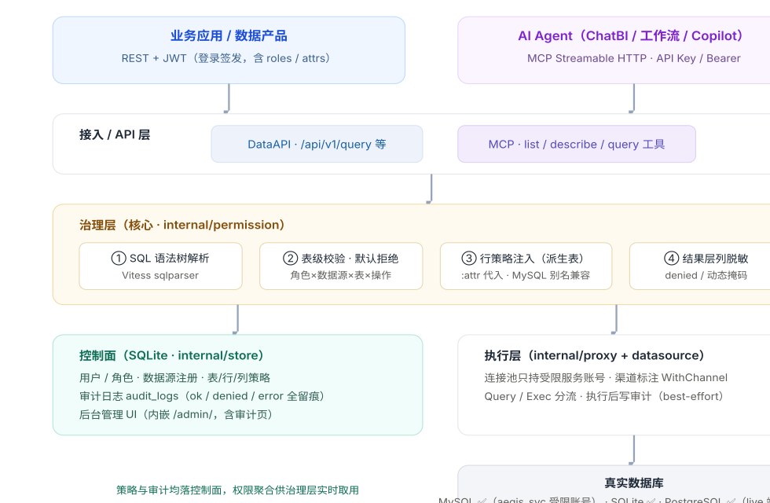

# Aegis · 数据库代理治理平台

项目 PRD 蓝图（Blueprint v0.6）— 集中治理数据服务，安全供给应用与 AI
Agent

Golang 单二进制 表 / 行 /
列三级治理 治理默认开启 全量审计 · 会话级串联 DataAPI（REST） MCP for AI
Agent MySQL 已接入 SSO
/ OIDC LDAP / AD 权限审批流

## 一、产品愿景与定位

Aegis 是介于业务应用 / AI Agent 与后端数据库之间的「数据服务网关」。

### 隔离账号

后端数据库仅持有受限服务账号；应用与 Agent 只持有平台签发的 JWT / API
Key，真实凭据永不外泄。

### 集中治理

表级授权、行级策略、列级脱敏在统一控制面配置，默认拒绝，按角色×数据源×表授权。

### 安全供给

对外提供 REST DataAPI 与 MCP 服务，让 AI Agent 像调用工具一样安全取数。

**核心价值：**把「谁能看什么数据」从散落在各业务代码、各数据库账号的隐式规则，收口为平台上的显式策略，使数据访问**可审计、可收敛、可供给
AI**。

### 市场定位与竞争策略（2026-07 复盘）

**核心判断：**「让 LLM Agent 安全查企业数据」是真实且正在放大的需求；MCP
正成为 Agent↔数据的标准协议，但**带治理的 MCP 网关**仍很薄。Aegis
的差异化不在功能广度，而在「**单二进制自托管 +
治理默认开启**」——把重型目录级的治理压缩成 10 分钟可跑的网关。

### 竞争象限（二维定位）

横轴=部署形态（轻量自托管 ↔ 重型平台），纵轴=治理范式（AI Agent 原生 ↔
传统面向人/BI）。

-   **轻量 + AI 原生（蓝海）：**Aegis 当前所在，相对空旷。
-   **重型 + 传统：**Collibra / Alation / Atlan 等数据目录。
-   **轻量 + 传统：**ShardingSphere / ProxySQL 等 SQL 代理（非 AI
    原生）。
-   **重型/初创 + AI 原生：**MCP 安全 / LLM 防火墙初创、dbt / Cube
    语义层。

### 护城河与风险

-   **顺风：**Agent 接数据的治理缺口、MCP 风口、单二进制易落地 Pilot。
-   **风险：**PII 识别 / NL2SQL / 语义描述正被 LLM
    能力本身吞掉，价值在**治理执行闭环**而非识别算法。
-   **单人天花板：**企业买家要 SSO / 审计对接 SIEM / 合规认证 /
    多租户，缺这些难进大客户。
-   **邻接升温：**数据目录厂商下沉、云厂数据库上绑、MCP
    安全初创抢同一批用户。

#### 产品策略 · 走「楔子」而非「平台」

不与重型目录拼广度，定位为「自托管、治理默认开启的 AI
数据网关」：开源单二进制让团队分钟级跑起来、把内部库变成受控 Agent
工具。护城河 = **部署简单 + 治理不可绕过**。商业化路径：OSS 积累采用率 →
托管版 / 企业版（SSO + 审计 +
多租户）收费。**第一成功指标是采用率，而非功能数。**

## 二、企业 AI 应用建设：项目必要性论证

AI
应用与传统应用的本质差异：**数据访问的发起者从「确定性代码」变成「概率性模型」**。SQL
由 LLM
现场生成——不可评审、不可穷举、可被提示词注入操纵。「应用持代码内控权限」的模式失效，治理必须下沉到数据访问层。

**一句话必要性：**没有治理代理层的 AI
应用，等价于给一个「不可控的实习生」发放生产数据库 root 密码。Aegis
把它换成「带工牌、有权限边界、全程录像」的受控访问。

### 五大风险 × 平台对策

#### 风险 1 · 凭据失控

提示词注入可诱导 Agent
执行任意工具调用，直连数据库时一次注入即交出整库；凭据随代码仓库、日志扩散。

#### 对策 · 账号隔离 已落地

AI 侧只持平台 JWT / MCP API
Key（可吊销、轮换、缩权）；后端使用受限服务账号（如 `aegis_svc` 仅授
`dh_demo.*`），root 永不出平台。

#### 风险 2 · 权限语义缺失

DB 原生账号只有「库/表」粒度，表达不了「租户 A 的 Agent 只能查租户 A
的数据」；为每个业务身份建 DB 账号运维上不可行。

#### 对策 · 三级治理 已落地

角色×数据源×表授权（默认拒绝）；行策略 `tenant_id = :tenant` 由 JWT
属性代入并注入为派生表；列级脱敏结果层强制执行，一处配置、全渠道一致。

#### 风险 3 · 幻觉 SQL 无兜底

NL2SQL 可能生成无 WHERE 的 DELETE、笛卡尔积
JOIN、越权查询；提示词约束对被注入或幻觉中的模型没有强制力。

#### 对策 · 解析级强制校验 已落地

SQL
先经语法树解析→表级校验→行策略重写→列脱敏，治理发生在**引擎层而非提示词层**；语句类型白名单，DDL
天然被拒。

#### 风险 4 · 合规不可追溯

数安法 / 个保法 / 等保 2.0 要求访问留痕。AI
访问高频、机器化，若无法回答「哪个 Agent
何时查了哪些数据」，泄露事件责任无法界定。

#### 对策 · 全量审计 已落地

`audit_logs` 对 ok/denied/error
三态全留痕：用户、渠道（dataapi/mcp）、原始与重写后
SQL、行数、耗时；管理台可多维过滤检索。

#### 风险 5 · 重复建设

多个 AI
项目各自接数据、各写权限与脱敏逻辑，成本翻倍、口径不一，安全水位取决于最薄弱的项目。

#### 对策 · 统一供给 已落地

DataAPI 服务传统应用，MCP 服务 AI
Agent，共享同一治理引擎与审计流水；新应用接入 = 发 Key +
配权限，分钟级完成。

### 典型 AI 场景映射

**📊 智能问数 / ChatBI**自然语言 → LLM 生成 SQL → **必须经 Aegis
强制治理后执行**。行策略保证「问自己能看的数」，列脱敏保证敏感字段不进对话上下文。

**🤖 Agent 工作流**报表生成、对账、运营巡检等多步骤 Agent 经 MCP
取数；API Key 映射低权身份，限流与行数上限防失控循环拖垮生产库。

**📚 知识库 RAG 增强**RAG 实时补充结构化数据（库存、订单状态）走受治理的
DataAPI，避免向量库之外再开「裸连」通道。

**💻 员工 Copilot**按登录者身份（JWT
attrs）取数，同一问题不同人得到各自权限内的答案——权限跟人走，而非跟应用走。

## 三、平台架构（v0.2 现状）

五层架构：接入方 → 接入/API 层 → 治理层（核心）→ 控制面 / 执行层 →
真实数据库。所有请求无论来自应用还是 AI Agent，都汇入同一条治理链路。

### internal/permission

权限引擎：解析→校验→重写→脱敏，治理语义唯一实现点

### internal/proxy

执行层：经引擎重写后执行，全路径审计埋点（成功/拒绝/失败）

### internal/mcp + api

双协议供给：REST DataAPI 与 MCP 共享同一治理与审计链路

## 四、治理模型（已落地）

### 认证模型

-   Bearer JWT：登录后签发，声明 `roles` 与 `attrs`（行策略占位符来源）
-   静态 API Key：MCP 客户端使用，映射到服务账号（继承某角色治理语义）
-   内置 `admin` 超级角色：旁路治理，用于运维与全量审计

### 三级治理语义

-   **表级：**角色×数据源×表 授权
    SELECT/INSERT/UPDATE/DELETE，**默认拒绝**
-   **行级：**谓词 `tenant_id = :tenant` 由 JWT attrs
    代入，注入为派生表（MySQL 下自动补别名）
-   **列级：**结果层按 `denied_cols`（deny 优先）脱敏 / 仅放行
    `allowed_cols`；另支持**动态值掩码**（phone/email/card/partial/hash/redact），列保留但
    PII 值脱敏

## 五、当前能力现状（v0.2）

以下能力已实现并完成端到端验证（含真实 MySQL 数据源）。

### 已实现 · 核心

-   已验证 集中权限 +
    后端账号隔离（受限服务账号 `aegis_svc`，root 不进平台）
-   已验证 表 / 行 / 列三级治理引擎（SQL
    解析重写 + 结果脱敏）
-   已验证 动态脱敏：列保留、PII
    值变换掩码（phone/email/card/partial/hash/redact），MCP 语义卡片标注
    masked
-   已验证 数据分级分类标签：PII / 敏感 /
    内部 / 公开 标签随语义目录透出，MCP 卡片标注 class: ... 并在
    nl2sql 提示词中提示 Agent 谨慎处理敏感列
-   已验证 真实 MySQL 8.0
    数据源在线注册与治理（含 JOIN 双表行策略）
-   已验证 全量审计：ok/denied/error
    三态、dataapi/mcp 双渠道留痕 + 管理台检索
-   已验证 异常行为告警：高频 denied /
    批量导出 / 非工作时段检测，控制面 `security_alerts` 落库 +
    管理台「安全告警」页 + 可选 Webhook
-   已验证 REST DataAPI：login / query /
    list datasources / describe table
-   已验证 MCP Streamable
    HTTP：list_datasources / list_tables / describe_table / query
-   已验证 后台管理
    UI（用户/角色/数据源/权限/策略 CRUD + 审计日志页 + 安全告警页）
-   已验证 SSO / OIDC 身份对接：OAuth2
    授权码 + PKCE，用户 auto-provisioning，claim→角色自动映射
-   已验证 LDAP / Active Directory
    身份对接：基于密码的目录单点登录，三步绑定校验，组→角色自动映射，用户
    auto-provisioning（external_id = ldap:<DN>）
-   已验证
    权限审批流：申请（为角色授予表访问）— 审批 — 生效 —
    回收闭环；审批通过自动落角色级 table_permissions 授权、撤回按
    granted_perm_id 精确删除，前端「审批流」页含申请视图与审批台
-   已验证
    健康探针：liveness（/api/v1/health）与
    readiness（/api/v1/ready，检查 store 可用性）
-   已验证 结构化日志：标准库
    log/slog（JSON / 文本），覆盖 HTTP 访问日志（req_id 关联）+
    治理决策事件（denied/error）+ 启动事件，可直接接入 Loki / ELK

### 已知边界（生产化前需补强）

-   行策略注入已**递归覆盖嵌套子查询（双层加固）**：顶层 FROM
    与任意深度子查询（IN / EXISTS / 派生表 / 标量子查询，含 DML 的 WHERE
    / SET 内嵌套子查询）中的表引用均受治理；纯数据库原生 RLS
    列为可选增强
-   列脱敏在结果层按列名执行，依赖查询返回原始列名
-   控制面为单文件 SQLite，未做多节点高可用
-   写操作行级约束仍建议以数据库原生 RLS 兜底（平台层对写操作做无 WHERE
    拦截、影响行数上限，并递归加固嵌套子查询）

## 六、演进路线图（五阶段）

从「基础稳固」起步，逐阶段向生产可用、企业治理、AI 增强、平台化演进。

### 阶段 1 · 基础稳固 已完成

三级治理 + 双协议供给 + 可管理后台，端到端验证通过。

### 阶段 2 · 生产化加固 进行中

-   已完成 真实数据源接入：MySQL 8.0
    在线注册 + 受限服务账号 + 全链路治理验证
-   已完成
    请求审计日志：谁、何时、何身份、原始/重写 SQL、行数、耗时、渠道
-   已完成 边界防护：按身份 /
    数据源限流、查询行数上限、超时熔断
-   已完成 可观测性：Prometheus
    指标、健康探针（liveness / readiness）
-   已完成 结构化日志：标准库 log/slog
    实现（JSON / 文本），覆盖 HTTP 访问日志（含 req_id 关联）+
    治理决策事件（denied/error 结构化告警）+ 启动/运行时事件
-   已完成 PostgreSQL 端到端验证：lib/pq
    驱动内置，live 集成测试覆盖默认拒绝 / 行策略(:attr) / 列脱敏 / admin
    旁路 / ListTables 治理
-   已完成 数据库原生 RLS
    双层加固（弥补嵌套子查询边界）：行策略注入递归进入任意深度子查询，顶层
    FROM 与 IN / EXISTS / 派生表 / 标量子查询中的表引用均受治理（含 DML
    的 WHERE / SET 内嵌套子查询）；纯数据库原生 RLS 列为可选增强

### 阶段 3 · 企业治理 进行中

-   已完成 统一身份：SSO / OIDC
    接入，OAuth2 授权码流程 + PKCE，用户
    auto-provisioning，claim→角色自动映射
-   已完成 LDAP / Active Directory
    接入：基于密码的目录单点登录，三步绑定（服务账号检索 → 解析用户 DN →
    用户 DN 绑定校验），组（group）→ 角色自动映射，用户
    auto-provisioning；`Directory` 接口抽象使逻辑可无服务单测
-   已完成
    脱敏算法库：哈希（hash）、掩码（phone/email/card/partial/redact）、**Tokenization**（确定性
    HMAC 假名，脱敏后仍可关联/聚合）与 **格式保留加密
    FPE**（对卡号/证件号等纯数字 PII 保长保型，密钥可经 `FpeDecrypt`
    还原）；密钥经 `AEGIS_MASK_SECRET`
    注入，未配置时回退开发默认值并告警
-   已完成 权限审批流：授权申请 — 审批 —
    生效 —
    回收闭环（申请以「为某角色授予某数据源某表访问」为粒度；审批通过自动落
    `table_permissions` 授权、撤回按 `granted_perm_id`
    精确删除，闭环可逆，不触碰用户↔角色关系）
-   已完成
    数据分类分级自动推荐默认脱敏：基于列分类（level + 标签 +
    列名）自动推导默认脱敏策略（phone/email/card/fpe/partial/tokenize），并提供
    `POST /admin/api/datasources/{id}/masks/recommend` 一键预览 /
    落地（按指定角色或全量非 admin 角色）；全新安装自动为 analyst
    角色套用推荐脱敏，列治理开箱可见
-   多租户隔离：组织 / 项目维度的工作区与配额

**ADR · 审批流建模在 RBAC 角色层（非用户层）**：Aegis 的治理授权原本就按
**角色** 而非个人聚合（`role_id` 是 `table_permissions`
的自然键），因此一次审批
=「为某角色新增对某表的授权」。申请人=请求的发起人（留痕），授权目标=角色。收益：复用现有引擎、闭环可逆（撤回仅删本审批创建的授权行）、不牵动用户↔角色成员图；代价：若需「仅给某个人临时授权」，需先建/指角色——对治理型平台这是更清晰、更可审计的模型。前端提供「提交申请
+ 我的申请」与「审批台（管理员）」双视图。

### 阶段 4 · AI 增强 部分落地

-   MCP 能力扩展：`resources`（表 schema
    语义卡片）、`prompts`（安全取数模板）已落地
-   NL2SQL 安全网关：自然语言 → SQL → 治理强制校验 →
    执行，端到端内置（LLM 生成 SQL 原样回灌受治理执行链路，只读强制 +
    已授权列约束）已落地
-   查询血缘与成本：EXPLAIN 预估扫描行数 / 影响范围，给 Agent 风险提示
    已落地
-   语义指标层（指标模板 + 类型化参数 + 运行期血缘）已落地
-   向量检索集成：结构化 + 语义混合检索作为统一 DataAPI（规划中）

### 阶段 5 · 平台化 远期

-   多实例集群：控制面与工作节点分离，水平扩展
-   插件市场：自定义连接器、脱敏算法、策略源（如 K8s CRD）
-   OpenAPI / SDK：自动生成各语言客户端与文档
-   治理即代码：策略以声明式文件纳入版本管理

## 七、面向 AI 场景的功能扩充规划

四个扩充方向按优先级展开，均在现有单二进制架构内演进、不引入新组件。①②
为阶段 3/4 前置项。

### P0 ① AI 数据供给增强

| 功能                    | 说明                                                                                                                                                                                                                                                                             | 状态   |
|-------------------------|----------------------------------------------------------------------------------------------------------------------------------------------------------------------------------------------------------------------------------------------------------------------------------|--------|
| MCP resources / prompts | 数据源目录、表结构语义卡片作为 resources 暴露；提供「如何安全查询」的 prompts 模板                                                                                                                                                                                               | 已落地 |
| Schema 语义描述         | 表/列业务含义注释（「amount = 含税订单金额」）随 `describe_table` 下发，提升 NL2SQL 准确率                                                                                                                                                                                       | 已落地 |
| 多数据源：NoSQL 适配器  | MongoDB / Elasticsearch 文档与搜索后端、Trino/Presto 联邦查询；治理（表权限 / 行策略 `$and`·`bool.must` / 列 allow-deny / 值脱敏）与 SQL 对齐，含 `insert/update/delete` 写入护栏（无 WHERE 拦截 + 影响行数预检）                                                                | 已落地 |
| NL2SQL 安全网关         | 「自然语言 → SQL → 治理校验 → 执行」端到端接口：LLM（OpenAI 兼容）生成只读 SQL 后原样回灌受治理执行链路，企业无需在每个应用重复实现；DataAPI 与 MCP 双入口                                                                                                                       | 已落地 |
| 语义指标层              | 管理员预定义核心指标（GMV、活跃用户）的 SQL 模板与类型化参数；Agent 运行指标而非现场编 SQL，根治口径漂移。参数经类型校验 + 枚举白名单 + 转义后安全渲染进模板，再回灌受治理执行链路；每次运行返回**血缘**（涉及表 / 敏感列 / 最高敏感度 / 是否含 PII）辅助 Agent 谨慎处理敏感结果 | 已落地 |
| 查询血缘成本            | 运行前用 EXPLAIN 预估扫描行数 + 结合数据敏感度（public→pii）合成 low/medium/high 风险等级与可读告警；读操作 EXPLAIN 治理后 SELECT，写操作复用 SELECT COUNT(\*) 预检估影响行数，全程只读零变更；SQLite 回退精确 COUNT。给 Agent「先评估再执行」的风险可视能力                     | 已落地 |
| 可观测性（Metrics）     | `GET /metrics` 暴露 Prometheus 指标：受治理查询数/延迟/返回行数（按 channel×status）、数据源与已发布数据集计数、构建版本；直接接入 Prometheus/Grafana                                                                                                                            | 已落地 |

### P0 ② AI 行为治理

| 功能         | 说明                                                                                                                    | 状态   |
|--------------|-------------------------------------------------------------------------------------------------------------------------|--------|
| 结果行数上限 | 按角色配置 max_rows，超限截断并审计标记，防全表拖库进 LLM 上下文                                                        | 已落地 |
| 查询超时熔断 | 按数据源配置执行超时，慢查询主动取消，保护生产库                                                                        | 已落地 |
| 限流与配额   | 按用户/Key 配置 QPS 与日查询量，防 Agent 失控循环                                                                       | 已落地 |
| 高危语句拦截 | 无 WHERE 的 UPDATE/DELETE 直接拒绝（可配置豁免）；单表写执行前 SELECT COUNT(\*) 预检影响行数，超 max_affected_rows 拒绝 | 已落地 |
| 查询成本预估 | 执行前 EXPLAIN，预估扫描行数超阈值拒绝并提示优化                                                                        | 远期   |

### P1 ③ 安全合规升级

| 功能                        | 说明                                                                                                                                                                                                  | 状态   |
|-----------------------------|-------------------------------------------------------------------------------------------------------------------------------------------------------------------------------------------------------|--------|
| 动态脱敏                    | 掩码显示（`138****0001`、邮箱域保留）替代整列剔除，兼顾可用性与安全；新增 **Tokenization**（确定性 HMAC 假名，可跨表关联分析）与 **格式保留加密 FPE**（卡号/证件号等纯数字 PII 保长保型，密钥可还原） | 已落地 |
| 数据集管理（Data Products） | 在数据源之上固化「查询 → 受治理的数据产品」：发布/下架生命周期、稳定字段契约、按名称供 Agent 消费；治理复用同一套表/行/列引擎（`table_name = 数据集名`），无需新建权限模型                            | 已落地 |
| 分级分类标签                | 列打 PII/敏感/内部/公开 标签，随语义目录与 MCP 卡片透出，并在 nl2sql 提示词中标注敏感列处理规则，对齐数据安全分级要求                                                                                 | 已落地 |
| 脱敏策略自动推荐            | 基于列分类（level + 标签 + 列名）推荐默认脱敏策略（phone/email/card/fpe/partial/tokenize），`POST .../masks/recommend` 一键预览并落地到角色，降低逐列手工配置成本；全新安装自动为 analyst 套用        | 已落地 |
| 审计升级                    | 关联 AI 会话 ID（一次对话多条查询串联，已落地）；异常行为告警（高频 denied / 批量导出 / 非工作时段，控制面 `security_alerts` 落库 + 管理台检索标记 + 可选 Webhook）                                   | 已落地 |
| 身份体系对接                | SSO / OIDC 统一身份（OAuth2 授权码 + PKCE + auto-provisioning + claim→角色映射）；LDAP / AD 基于密码目录单点登录（三步绑定 + 组→角色映射 + auto-provisioning）；API Key 到期与轮换机制                | 已落地 |

### P1 ④ 平台化与生态

| 功能           | 说明                                                                                                                                      | 状态     |
|----------------|-------------------------------------------------------------------------------------------------------------------------------------------|----------|
| 多数据源扩展   | MongoDB / Elasticsearch / Trino（已落地，治理与 SQL 对齐）；PostgreSQL（驱动已内置，待端到端验证）；达梦、OceanBase、TiDB 等信创/分布式库 | 部分具备 |
| 读写分离路由   | AI 查询默认路由只读副本，与交易流量物理隔离                                                                                               | 规划     |
| 低代码 DataAPI | SQL 模板 + 参数定义一键发布为受治理的 REST 接口                                                                                           | 规划     |
| 云原生部署     | K8s Helm Chart、多副本（控制面迁 PostgreSQL）、Prometheus、OpenTelemetry                                                                  | 规划     |

**实施节奏建议（2026-07 重排）：**基于「轻量 +
治理默认开」的楔子策略，优先级重排为——**① 先补企业门槛**：审计关联 AI
会话 ID（会话级串联，强化「全程录像」卖点）+ 异常行为告警，SSO / OIDC
身份对接；**② 同时把 MCP 治理能力讲成开发者故事**（README /
落地页叙事），尽早验证 OSS 采用率；**③ 再纵深**：PostgreSQL
端到端、NL2SQL
安全网关、语义指标层。避免与重型目录拼功能广度，集中资源把「治理不可绕过
+ 会话级可审计」打成招牌。

## 八、能力演进矩阵

| 能力域            | 阶段1 | 阶段2 | 阶段3 | 阶段4 | 阶段5 |
|-------------------|-------------------------------------|-------------------------------------|-------------------------------------|-------------------------------------|-------------------------------------|
| 表/行/列治理      | 基础 ✅                              | RLS 加固 ✅                          | 分类分级 ✅                          | NL 校验                             | 声明式                              |
| 数据源接入        | SQLite ✅                            | MySQL ✅ / PG                        | 信创库                              | 向量源                              | 插件源                              |
| 协议供给          | REST+MCP ✅                          | 限流/行数上限                       | 审批流                              | resources/prompts                   | SDK/OpenAPI                         |
| 身份体系          | JWT/Key ✅                           | 审计日志 ✅                          | SSO/OIDC ✅                          | LDAP / 会话关联审计                 | 联邦身份                            |
| 脱敏能力          | 列隐藏 ✅                            | 结果校验                            | 动态掩码/算法库                     | 智能推荐                            | 策略市场                            |
| 高可用 / 可观测性 | 单实例                              | 探针/指标 ✅                         | 容灾                                | —                                   | 集群                                |

## 九、技术栈蓝图

### 语言 / 运行时

Golang 单二进制；零外部依赖即可运行

### 控制面存储

SQLite（modernc，纯 Go）；可平滑替换为 PostgreSQL

### SQL 解析

Vitess sqlparser 分支：解析、重写、注入行策略

### 数据源驱动

go-sql-driver/mysql、lib/pq、modernc/sqlite

## 十、关键度量指标

100%

默认拒绝覆盖率（无授权即拒绝）

3 级

治理粒度（表 / 行 / 列）

3 态

审计留痕（ok / denied / error）

2

对外协议（REST DataAPI / MCP）

**建议补充的运营指标：**策略命中率、被拒绝查询占比、平均治理重写耗时、各数据源查询
P95 延迟、AI 渠道（mcp）查询占比与截断率。应在阶段 2
的「可观测性」中落地。

## 十一、风险与边界

### 治理完整性

行策略注入已递归覆盖嵌套子查询（双层加固），平台层治理不可绕过；非
SELECT 写操作的行约束仍建议以数据库原生 RLS 兜底，平台层已做无 WHERE
拦截、影响行数上限与嵌套子查询递归加固。

### 可用性与性能

每次查询经 SQL 解析与重写有少量开销；单实例 SQLite 控制面是单点。阶段
2/5 分别补强。

### 凭证与密钥

JWT 签名密钥、数据源密码需纳入密钥管理（KMS / Vault），避免明文落盘。

### AI 特有风险

Agent 失控循环拖垮生产库、全表结果进入 LLM 上下文造成二次泄露——需 P0-②
行为治理（限流 / 行数上限 / 超时）落地后方可上生产。

## 十二、建议的下一步

-   **已完成（P0-②）：**结果行数上限 + 查询超时 + 限流配额 + 写操作无
    WHERE 拦截与影响行数上限——proxy 层集中实现，AI 上生产硬前提已满足
-   **已完成（P0-①）：**MCP resources + Schema 语义描述，直接提升 Agent
    取数体验与 NL2SQL 准确率
-   **已完成（P1-③）：**数据分级分类标签（PII / 敏感 / 内部 / 公开）随
    Schema 语义卡片与 MCP 目录透出，并在 nl2sql
    提示词中标注敏感列处理规则
-   **已完成（楔子策略首役 · 本轮）：**审计关联 AI 会话
    ID（会话级串联，强化「全程录像」卖点）+ 异常行为告警（高频 denied /
    批量导出 / 非工作时段 → 控制面 `security_alerts`
    落库、管理台可检索标记、可选 Webhook）。下一步把 MCP
    治理能力整理为开发者叙事（README / 落地页），启动 OSS 采用率验证。
-   **已完成（企业门槛 · 本轮）：**SSO / OIDC 身份对接——OAuth2
    授权码流程 + PKCE，用户
    auto-provisioning，claim→角色自动映射；健康探针增强（/api/v1/ready
    就绪检查）
-   **已完成（企业门槛 · 本轮）：**LDAP / Active Directory
    身份对接——基于密码的目录单点登录，三步绑定校验（服务账号检索 →
    解析用户 DN → 用户 DN 绑定），组（member）→
    平台角色自动映射（claim_mappings），用户
    auto-provisioning（external_id = ldap:<DN>），与 OIDC
    共用同一套外部身份供给/签发链路；`Directory`
    接口抽象使逻辑可无目录服务的单元测试覆盖
-   **已完成（AI 增强 · 本轮）：**NL2SQL 安全网关——自然语言经
    LLM（OpenAI 兼容）生成**只读**
    SQL，原样回灌受治理执行链路（表/行/列治理、脱敏、审计全部生效）；提供
    DataAPI（`POST /api/v1/datasources/{id}/nl2sql`）、MCP 工具 `nl2sql`
    与受治理 Schema 查看端点；生成阶段强制只读 + 仅引用已授权列。
-   **短期：**权限审批流增强（审批人分组 / 时限 /
    自动撤回）；查询成本的可观测延伸（估算结果按 risk_level 落审计 /
    异常高成本扫描告警）
-   **已完成（AI 增强 · 本轮）：**查询血缘成本（Query Lineage &
    Cost）——运行前用 EXPLAIN 预估扫描行数 /
    影响范围，并结合数据敏感度（public→pii）合成 low/medium/high
    风险等级与可读告警；读操作 EXPLAIN 治理后 SELECT、写操作复用 SELECT
    COUNT(\*) 预检估影响行数，全程只读零变更；SQLite 回退精确
    COUNT，开发态开箱可用。提供
    DataAPI（`POST /api/v1/datasources/{id}/query/estimate`）与 MCP 工具
    `estimate_query`。
-   **中期：**多租户工作区（企业版前置）— 隔离模型 ADR 已起草：[ADR-001](docs/adr/0001-multi-tenant-workspace.md)（Proposed，待评审）
-   **已完成（AI 增强 · 本轮）：**语义指标层（Curated
    Metrics）——管理员预定义受治理的 SQL 模板指标（类型化参数 +
    枚举白名单），Agent 运行指标而非现场编
    SQL，根治口径漂移；参数经类型校验 +
    转义后安全渲染，再回灌受治理执行链路，每次运行返回**血缘**（涉及表 /
    敏感列 / 最高敏感度 / 是否含 PII）辅助 Agent 谨慎处理敏感结果；提供
    DataAPI（`GET .../metrics`、`POST .../metrics/{name}/run`）与 MCP
    工具 `list_metrics` / `run_metric`。
-   **远期：**集群化 + 插件市场 + 治理即代码，升级为「AI 数据服务中台」

Aegis 项目 PRD 蓝图 v0.8 · 更新于 2026-07-27 · 已合并「企业 AI
应用建设场景」必要性论证、功能扩充规划（原 AI-SCENARIO.md
专项文档），新增「市场定位与竞争策略（2026-07 复盘）」、**SSO/OIDC
身份对接**、**健康探针增强**、**结构化日志（标准库
log/slog，JSON/文本，含访问日志与治理决策事件）**、**脱敏算法库（Tokenization
确定性假名 + 格式保留加密 FPE）**、**LDAP / Active Directory
身份对接**，以及本轮 **数据分类分级自动推荐默认脱敏**（基于列分类 level
+ 标签 + 列名推导默认脱敏策略，提供 `POST .../masks/recommend` 一键预览
/ 落地，全新安装自动为 analyst 套用）。另含阶段2 **RLS
双层加固**（行策略递归注入任意深度嵌套子查询）、**NL2SQL 安全网关**（LLM
生成只读 SQL 回灌受治理执行链路，DataAPI + MCP 双入口）。密钥经
`AEGIS_MASK_SECRET` 注入。当前版本为单二进制 Golang 实现，三级治理 /
审计 / OIDC / LDAP / 真实 MySQL / PostgreSQL
已端到端验证。文档与代码同源维护于本仓库（模块
`github.com/wisonwang/aegis`）。
