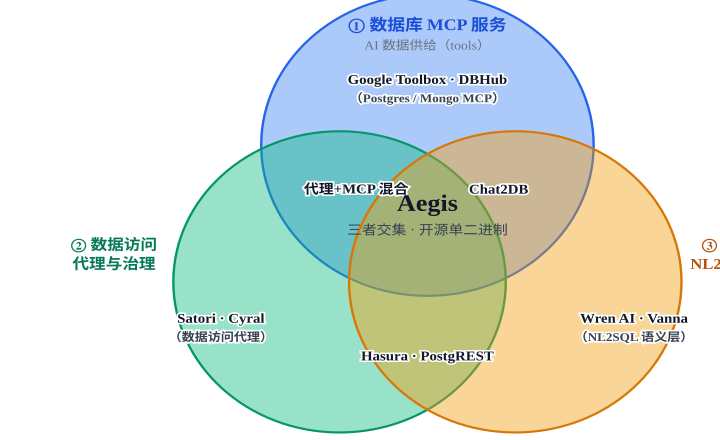

# Aegis 市场定位与竞品对比分析

数据库代理 + 三级治理 + 面向 AI Agent 的 MCP 语义供给网关 · 调研日期
2026-07-24

**核心结论：**Aegis 定位于一个当前竞品**交集空白**的赛道——*AI
数据供给网关*。 它把三类能力收进同一个开源 Go 二进制：① 数据库 **MCP
服务**（让 Agent 安全查数据）、 ② **数据访问代理与治理**（凭证隔离 +
表/行/列三级管控）、③ **语义层供给**（resources 语义卡片 + prompts
NL2SQL 模板）。 据 Bytebase（治理厂商）2026 年复盘：DB MCP
服务器普遍"会说话的引擎多、做治理的少，二者兼得的几乎为零"。 Aegis
正是"既能跨多引擎、又在代理层治理数据"的那一类，且以开源单二进制形态交付。

## 一、定位图：Aegis 处于三类能力的交集

说明：三圆分别代表当前市场三类主要玩家（详见第三节）。Aegis
并非任一圆的"加强版"，
而是把三圆的能力正交组合后落在中心交集——这也是竞品清单里**没有直接对手**的原因。

## 二、能力对比矩阵

<table style="width:100%;">
<colgroup>
<col style="width: 16%" />
<col style="width: 16%" />
<col style="width: 16%" />
<col style="width: 16%" />
<col style="width: 16%" />
<col style="width: 16%" />
</colgroup>
<thead>
<tr class="header">
<th>能力维度</th>
<th>Aegis</th>
<th>数据库 MCP Server 
Google Toolbox / DBHub</th>
<th>数据访问代理/治理 
Satori / Cyral</th>
<th>即时 API 
Hasura / PostgREST</th>
<th>NL2SQL / 语义层 
Wren / Vanna / DB-GPT</th>
</tr>
</thead>
<tbody>
<tr class="odd">
<th>后端凭证隔离（AI 不接触 DB 密码）</th>
<td>✓代理持有连接池</td>
<td>✓服务账号 / DSN</td>
<td>✓</td>
<td>△多依赖 DB 角色/直连</td>
<td>△多数直连</td>
</tr>
<tr class="even">
<th>表级权限（默认拒绝）</th>
<td>✓默认拒绝</td>
<td>△tools.yaml 白名单</td>
<td>✓</td>
<td>✓Hasura RBAC</td>
<td>✗下沉 DB</td>
</tr>
<tr class="odd">
<th>行级策略（属性代入 / 派生表）</th>
<td>✓:attr 动态注入</td>
<td>△仅预定义工具内</td>
<td>✓</td>
<td>✓Hasura/RLS</td>
<td>✗</td>
</tr>
<tr class="even">
<th>列级脱敏 / 掩码</th>
<td>✓结果层 mask</td>
<td>△角色列白名单</td>
<td>✓</td>
<td>✓Hasura 列权限</td>
<td>✗</td>
</tr>
<tr class="odd">
<th>MCP tools（执行查询）</th>
<td>✓</td>
<td>✓✓核心能力</td>
<td>✗</td>
<td>✗</td>
<td>△</td>
</tr>
<tr class="even">
<th>MCP resources（模式语义卡片）</th>
<td>✓带业务语义</td>
<td>△部分支持</td>
<td>✗</td>
<td>✗</td>
<td>△</td>
</tr>
<tr class="odd">
<th>MCP prompts（NL2SQL 安全模板）</th>
<td>✓</td>
<td>✗</td>
<td>✗</td>
<td>✗</td>
<td>✓NL2SQL 本身</td>
</tr>
<tr class="even">
<th>语义层供给（描述/同义词/示例）</th>
<td>✓</td>
<td>△</td>
<td>✗</td>
<td>✗</td>
<td>✓语义建模</td>
</tr>
<tr class="odd">
<th>多引擎覆盖</th>
<td>△当前 MySQL/PG/SQLite</td>
<td>✓✓最广</td>
<td>✓✓</td>
<td>△多 Postgres 系</td>
<td>✓</td>
</tr>
<tr class="even">
<th>审计留痕</th>
<td>✓ok/denied/error</td>
<td>△</td>
<td>✓</td>
<td>△</td>
<td>✗</td>
</tr>
<tr class="odd">
<th>部署形态</th>
<td>单 Go 二进制</td>
<td>单二进制/容器</td>
<td>平台/SaaS</td>
<td>容器/云</td>
<td>服务/框架</td>
</tr>
<tr class="even">
<th>开源</th>
<td>✓（计划）</td>
<td>✓</td>
<td>✗商业</td>
<td>✓</td>
<td>✓</td>
</tr>
</tbody>
</table>

图例：✓ 原生支持 · △ 部分/间接支持 · ✗ 不支持。

## 三、竞品 landscape 与逐类评估

### ① 数据库 MCP Server（AI 数据供给）

代表：Google MCP Toolbox（原 GenAI
Toolbox）DBHub（Bytebase） Postgres MCP ProMongoDB /
Supabase / Neon / ClickHouse MCP阿里云瑶池
MCP

-   **强项：**让 Agent 标准化连接数据库，工具定义清晰；Google Toolbox
    支持 `tools.yaml` 声明式白名单、IAM
    认证、最小权限、参数化查询，引擎覆盖最广（含 BigQuery/Spanner/Mongo
    等）。
-   **弱点：**治理*止于工具定义层*——它决定"Agent
    能调哪些预定义工具"，但**不做运行时行策略/掩码/审计**；DBHub
    自身明确"不鉴权 HTTP
    客户端、无掩码、无审计"。它们把"能查什么数据"交还给 DB 或预置模板。
-   **与 Aegis：**Aegis 同样给 Agent 提供 MCP
    tools，但治理下推到**代理执行层**（任意到达的 SQL
    都过表/行/列关卡），并**额外**提供 resources/prompts 语义供给。

### ② 数据访问代理 / 治理平台

代表：SatoriCyral（现
Normalyze）Varonis

-   **强项：**真正的"数据控制平面"，跨数据源统一策略、脱敏、审计，企业级发现与编排能力强。
-   **弱点：**多为**商业 SaaS/平台**，部署重、成本高；**不为 AI
    供给语义**，也没有 MCP resources/prompts 这类面向 Agent 的接口。
-   **与 Aegis：**Aegis
    以开源单二进制覆盖核心三级治理，定位更轻、更偏"给 AI
    用"；企业级策略编排/数据发现不及这类平台。

### ③ 即时 REST / GraphQL API 生成器

代表：HasuraPostgRESTSupabaseDreamFactoryDirectus

-   **强项：**Hasura 的 RBAC 其实**很细**——行列级 + 谓词下推（predicate
    pushdown）+ 列权限，且有成熟社区与实时订阅；PostgREST 把治理甩给
    Postgres RLS。
-   **弱点：**它们是**面向应用的 API 层（GraphQL/REST）**，**不是面向
    Agent 的 MCP**，也没有语义供给；Hasura 核心强绑定 Postgres。
-   **与 Aegis：**在"把数据交给 AI"这一层，Aegis 更对口——治理 + MCP
    供给一体；权限粒度上 Hasura 是强劲参照，但协议与受众不同。

### ④ NL2SQL / 语义层

代表：Wren AIVanna.aiDB-GPTChat2DBDataherald

-   **强项：**把自然语言转
    SQL，自带语义建模（指标/同义词/关系），显著提升准确性。
-   **弱点：几乎不碰治理与凭证隔离**（多数直连
    DB），越权/脱敏不在其职责内。
-   **与 Aegis：**天然**互补**——Wren/Vanna 做"理解"，Aegis 做"供给 +
    管控"。Aegis 自身**不内置 NL2SQL 模型**，而是把治理后的 schema +
    安全 prompt 喂给外部 LLM。

### ⚠ 命名撞车提醒

**命名说明：**本项目原名 **DataHub**，已于 2026-07-24 正式更名为
**Aegis**（副标题 *AI Data Supply Gateway*），专门规避与 LinkedIn /
Acryl **DataHub**（知名数据目录 / metadata catalog 产品）的品牌与 SEO
混淆——二者是完全不同的产品。对外材料统一使用「Aegis」及上述副标题。

## 四、Aegis 优劣总结

### 优势 / 差异化

-   **三位一体，单二进制：**代理隔离 + 三级治理 + MCP
    语义供给同处一个开源 Go 二进制，部署极简。
-   **默认拒绝的安全基调：**治理与查询路径（DataAPI +
    MCP）解耦但统一执行，任意到达的 SQL 都过表/行/列关卡。
-   **面向 Agent 的原生供给：**resources 提供带业务语义的 schema
    卡片，prompts 直接给 NL2SQL 安全模板，降低 LLM 幻觉与越权。
-   **凭证不落 AI 侧：**后端账号集中管控，AI 只持 API Key / Bearer。
-   **全量审计：**ok/denied/error 全留痕，合规友好。

### 劣势 / 风险

-   **生态年轻：**对比 Hasura/Supabase/Wren，成熟度、文档、社区差距大。
-   **引擎覆盖窄：**当前仅 MySQL/Postgres/SQLite，远不及 Google
    Toolbox。
-   **不内置 NL2SQL：**只做供给与管控，语义理解依赖外部 LLM。
-   **无 GUI 查询 IDE：**管理后台偏薄，无 Chat2DB 式可视化。
-   **无 GraphQL 输出：**仅 DataAPI(REST) + MCP。
-   **规模化未验证：**单二进制默认单实例，水平扩展/高并发待生产检验。
-   **已完成更名：**由 DataHub 更名为 Aegis，规避与 Acryl
    DataHub（数据目录）混淆。

## 五、定位结论与建议

**一句话定位：**Aegis 不是要取代上述任何一类，而是做*AI 数据供给网关*——
把"治理后的、带业务语义的、可审计的"数据能力，以 MCP 标准化协议交给
Agent。这是当前竞品清单里的**交集空白**。

### 短期行动建议

-   **补引擎：**接入更多方言（ClickHouse / DuckDB / Oracle 等），缩小与
    Google Toolbox 的覆盖差距。
-   **强语义：**支持从 DB 注释 / 外键 /
    已有目录**自动抽取**语义，降低人工录入成本。
-   **明品牌：**确定开源协议，主标题加副标题（AI Data Supply
    Gateway），规避与 Acryl DataHub 混淆。
-   **做互补而非重造：**与 Wren AI / Vanna 类 NL2SQL 工具做"供给 +
    管控"集成，让专业模型负责理解、Aegis 负责供给与兜底治理。
-   **打透差异化卖点：**"开源 · 单二进制 · 默认拒绝的三级治理 + 面向 MCP
    Agent 的语义供给与全量审计"。

资料来源：Bytebase《Top 3 Open Source Multi-Database MCP Servers in
2026》、Google Codelabs《Deploy an Enterprise Governance-Aware Agent
with MCP and Cloud Run》、 Google MCP Toolbox 官方文档、Hasura
Authorization 文档、PostgREST Database Authorization 文档（均检索于
2026-07-24）。 本报告为市场定位与竞品对比分析，不含任何商业背书。

